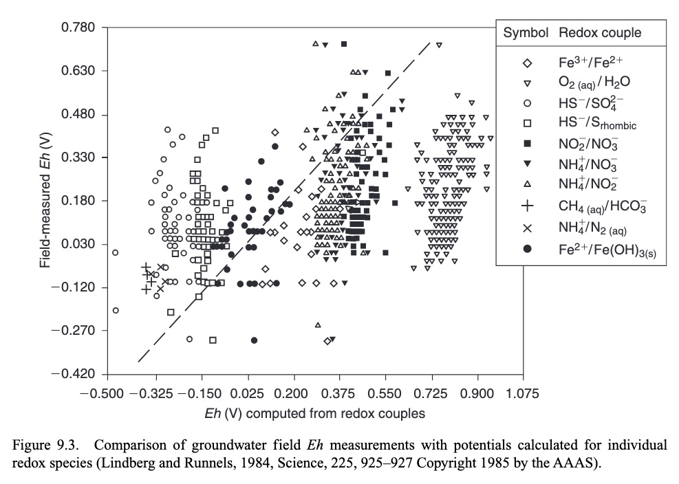

# Week 3.8 Redox/Pourbaix/Stability diagrams

## Week structure and reading material
Reading material:
-   Geochemistry, groundwater and pollution, Appelo and Postma - Chapter 9: 9.1, 9.2
-   Extra background reading: chapter 3.1.5 [Corrosion Science and Technology, Talbot](https://cdn.preterhuman.net/texts/science_and_technology/chemistry/Corrosion%20Science%20and%20Technology.pdf)
 
Week structure:
-   Monday March 30 13.45 - 17.45: 1h lecture, followed by guided excercise and self-study
-   Wednesday April 1 15.45 - 17.45: self-study
-   Thursday April 3 08.45 - 12.45: 1h lecture, followed by guided excercise and self-study

## Introduction

In the past weeks you studied acid-base and redox chemistry. These two concepts are important factors in determining which dissolved species and solid minerals are stable in environments with certain combinations of pH and EH. This can be graphically represented with redox diagrams, also referred to as Pourbaix, pH - EH, or pH-pe diagrams. See below for an example: the Pourbaix diagram for the nickel-water system at 25 'C and a dissolved Ni2+ concentration of 10-6 M. This week you will learn how to *interpret* and *draw* diagrams like this, using the principles of acid-base and redox chemistry. 

When drawing and interpreting redox diagrams, you need to consider a few important points:

-   *You* (or another author) decide which species you include in the diagram. Keep this in mind when assessing how representative a diagram is for the real world example you are considering.
-   The concentration of the species you include are not variable, but fixed. They therefore need to be included in the description of the diagram, as they partly determine what it looks like. When choosing a concentration, consider which values are representative of relevant real world examples.
-   The redox diagram can include redox reactions, dissolution reactions, and (de)protonation reactions. The involvement of electrons and/or protons determines the direction of the associated lines in the redox diagram.
-   As described below, redox diagrams can be plotted with pe or EH on the y-axis. Both are valid, with pe and EH related via a linear relationship. 

### Redox half reactions: from EH to pe
Read paragraph 9.1.2 in Appelo & Postma, and go through Example 9.3. Compare it to Example 9.1, where the Nernst equation is used to answer the same question. As you can see, both approaches are valid, and give the same answer. They use the principle that when two redox half reactions are at equilibrium, their EH (and therefore the pe) are the same. Note that while not explicitly mentioned in example 9.3, the equilibrium constant for the two half reactions are given in the text, and you should be able calculate them yourself. See equation 20.6 in Tro Chapter 20. Note that while there the Ecell is considered, here we use the EH of the half reactions. 

Both concepts (EH and pe) are used widely in geochemical literature. As described on page 423, EH and pe are related according to the following equation (extra: test yourself, can you derive this from the equations indicated in the text, 4.26, 9.7 and 9.8?):

$$ E_H=\frac{2.303RT}{F} pe $$

### Drawing a redox diagram for dissolved species 
We will go through an example of drawing a redox diagram for dissolved species, using arsenic as example (see chapter 1 for more details on arsenic contamination of drinking water), detailed in paragraph 9.2.2 (A&P). It is important to first consider the stability of water, the solvent in aqueous chemistry. Study paragraph 9.2.1 and the given figure 9.4.

This paragraph illustrates a few basic steps to drawing a redox diagram:
-   select the relevant species and (half) reactions. For the As example, table 9.3 shows the selected reactions and their (tabulated) log K values. Note that there are both (de)protonation, so acid-base reactions, and redox half reactions in this table.
-   Use the mass action equation for the (half) reactions, see e.g. eq. 9.18, and the tabulated log K to derive the equations relating the pH and/or pe of the reaction with K, as done in eq. 9.33, 9.34 and 9.35
-   The lines in a Pourbaix diagram indicate that the two relevant species are present at equal activity (here we use concentrations as activity), simplifying the equations derived in the point above by setting K = 1 (or log K = 0).
-   The given equations might have to be combined to get the relation between two species not directly described in the given half reactions. E.g. HAsO42- and H2AsO3-. 

### Understanding pH and EH measurements
As a sidenote, it is relevant to consider the practical use of EH in a bit more detail. While EH might seem similar to pH (pH = - log [H+]), in reality it is not. Both can be measured with a probe, but while pH is a direct measure of the proton concentration, EH does not measure electron concentration directly, since electrons don't exist freely in solution. Rather, it is a measure of the 'tendency of a solution to donate or accept electrons'. To understand this better, look at how a pH probe and an ORP (Oxidation Reduction Potential) probe or sensor work. You can also have a look on websites of sensor manufacturers, many of them have simple explanations of how their products work. See for example [the explanation from Hamilton:](https://www.hamiltoncompany.com/knowledge-base/article/orp-basics?srsltid=AfmBOoqQh-vzIYEy7bIrraa7PyhW9Oej7Nh_xMBcRpqSNvbqr26-7nBo).

As you can see, both pH and ORP sensors have a similar set-up, and both have a signal in mV as output. In pH meters this voltage can be directly converted to [H+] activity (which is very close to concentration in dilute solutions) via the Nernst equation. However, this is not the case for ORP meters. The mV signal registered by an ORP probe reflects whether there are more 'oxidizing molecules', more 'reducing molecules', or whether the activities of both are at equilibrium. Depending on the composition of the solution measured, the reactions involved in the overall redox equilibrium can be numerous and complex. 

Another, even more urgent issue with interpreting the EH value is that the theoretical EH calculated based on the measured chemical composition and the measured EH can be quite different. This is explained in paragraph 9.1.1 in Appelo & Postma, with the following figure 9.3: 

You can see here, that while you would expect a calculated and measured EH to be similar, this is clearly not the case. As explained in the accompanying paragraph (9.1.1), this can be due to different factors, such as the (dis)equilibrium in the solution and the insensitivity of the electrode to certain species important for the ORP (O2). Some authors even go so far as to say that because of these limitations, measuring the ORP is generally not recommended ([Nordstrom et al., 2005](https://pubs.usgs.gov/twri/twri9a6/twri9a65/twri9a_6.5_v_1.2.pdf)). In certain cases, such as acid mine drainage (AMD), theoretical and measured ORP are very similar due to the extremely high concentrations of dissolved iron. The Fe2+/Fe3+ redox couple then controls the ORP directly, and is a useful parameter to measure. 

Does this mean we should not bother about measuring the ORP? No, but it does illustrate the importance of understanding the theoretical and technical details and limitations of the experimental methods you use. EH measurements can for example show how the water chemistry of a sampling site evolves over time, or indicate the existence of strong redox gradients in for example stratified lakes (lakes where the water is not significantly mixed, allowing for the development of layers with distinct physicochemical characteristics). 

For our purposes here, we leave this methodological issue aside. 
